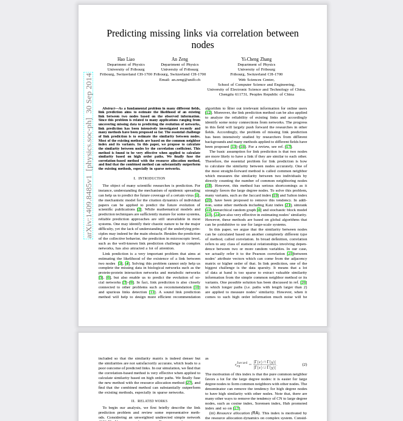
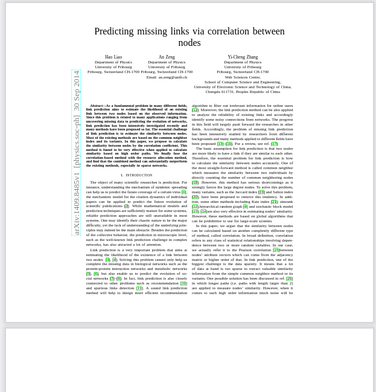

Add margins to PDFs
===================

I have a tablet with a pen as ebook-reader. 
I like to make notes on the side of the PDFs when reading. 
Often there is not enough space on the margins. 

I also like to draw diagrams and notes on the PDF. 
There is not enough space at the top and bottom. 
This leads to bad nodes and diagrams I can not decypher later.

This tool adds margins around the text. With this I have enough 
space for my thoughts and ideas and space to learn.

# Features

- Add marigins around the text 
- Fixed points as margin (e.g. 100)
- Relative margin (e.g. `left=0.3`)

Before:



After:




```markdown
## Installation

To install the `pdfmargins` package, use one of the following commands:

**CLI Only**:
If you only need the command-line interface, run:
```bash
pip3 install pdfmargins
```

**CLI + Gradio App**:
If you want to include the Gradio app as well, use:
```bash
poetry install pdfmargins[app]
```

**CLI + FastAPI API**:
To include the FastAPI API, run:
```bash
poetry install pdfmargins[api]
```

**All Components (CLI, Gradio App, FastAPI API)**:
If you want to install everything, use:
```bash
poetry add pdfmargins[all]
```

**From within the project**:
If you cloned the project, run in the project root:
```bash
poetry install --with all
```


### Verifying the Installation

To verify that the installation was successful, you can run the CLI command:
```bash
pdfmargins --help
pdfmargins-app --help # if installed
pdfmargins-api --help # if installed
```
This should display the help information for the command-line interface.

## Usage

See `scripts/example_usage.sh` for a runnable script, that is also
checked by the test-suite (e2e).

Common use-case is to run 

```python3
python3 cli.py path/to/pdf-file.pdf
```

This creates a file called `path/to/pdf-file.margins.pdf` as output.

Or you can process a directory via 

```python3
python3 cli.py path/to/dir/with/pdfs/
```

If there is a `path/to/dir/with/pdfs/a.pdf` there is now a 
`path/to/dir/with/pdfs/a.margins.pdf` as output.

If you want to know more, check

```python3
python3 cli.py --help
```

## More information

If you nee to know details, check out `pdfmargins/cli.py`. It is pretty straightforward.

## Limitations and next Steps

- Output-directory, not only suffix for output-files 
- FastAPI server in Dockerfile to make installation easy (with Gradio UI)
- Make it intallable (as python-package)
- Add nix-package
- Detect if 2 columns and be smart where to add margins (1 column, only right margin)
- Add background, like raster, dots, etc.

## Next steps

- Make it installable
- Push to pypi
- Set into metadata that margins were added
- One or two columns?

## Thank you

This is just a wrapper around 

* pypdf
